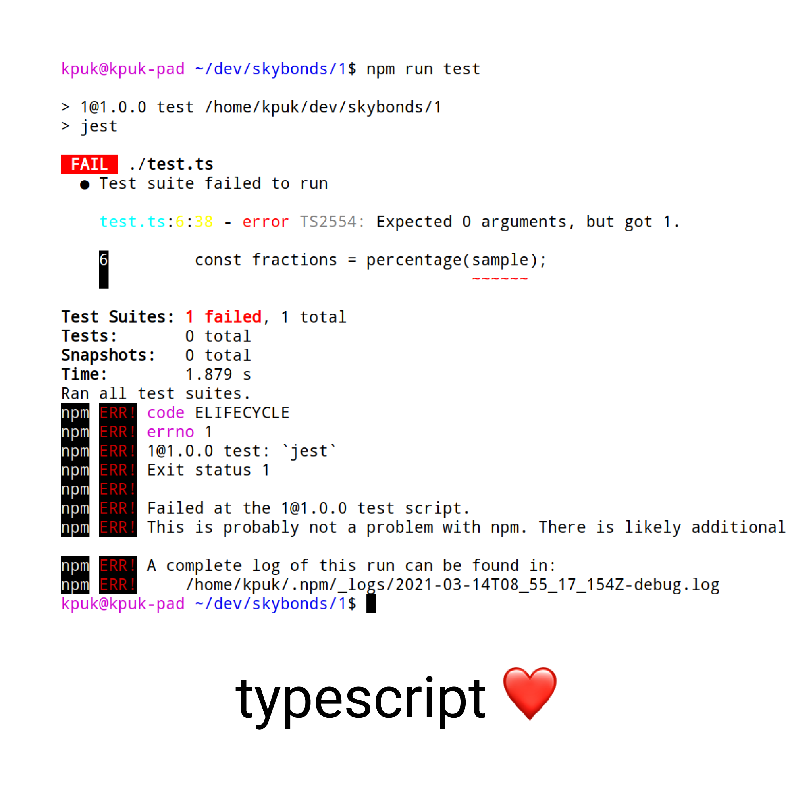

# Typescript окружение

# Jest тестирование

Написал четыре кейса, которые специально ранял,

зная, какую часть логики они тестируют,

или не специально..

Или вот тест был написан не совсем корректно:

(сравнение toBe vs toEqual vs toStrictEqual)

# Итого

Счетчики показывают 100% покрытие, код статически типизирован.

Но это не отменяет того, что я мог неправильно понять задачу и например доли для массива нулей - массив нулей.

Как говорится, тесты не доказывают отсутствие багов, они показывают их присутствие.

Эти тесты например не покрывают граничные случаи арифметики дробных чисел в js.
