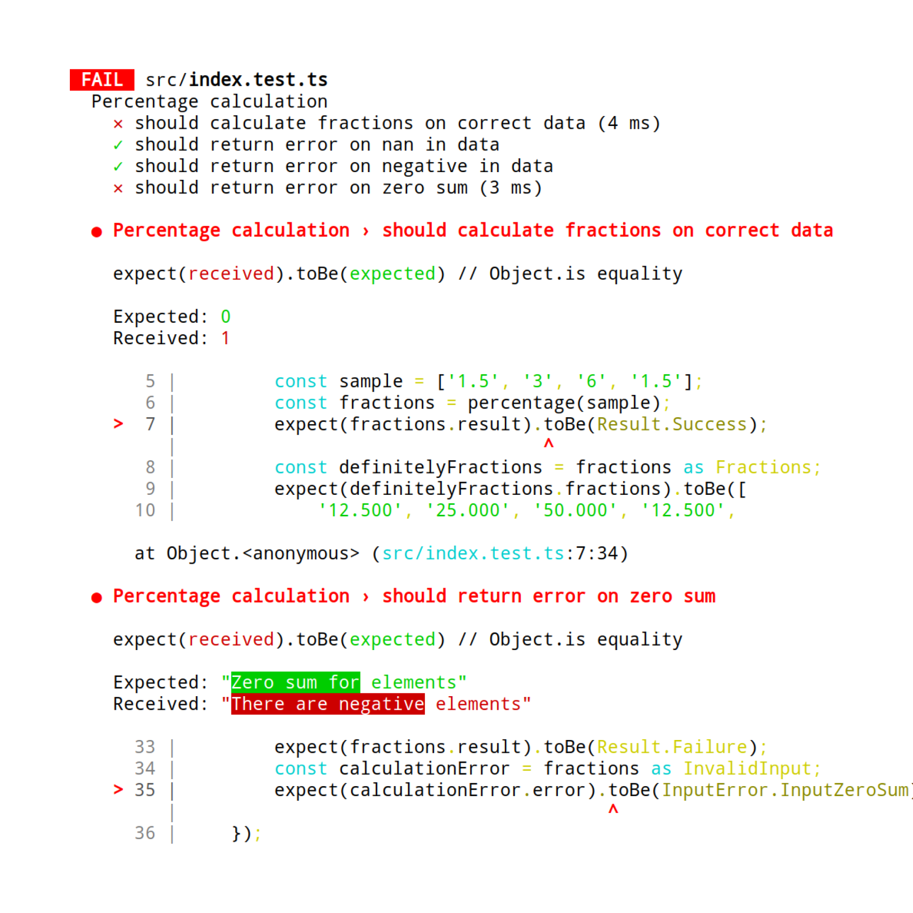

# Typescript окружение

# Jest тестирование

написал четыре кейса, которые специально ранял

зная, какую часть логики они тестируют

или не специально

или тест был чуть неправильно написан

(сравнение toBe vs toEqual vs toStrictEqual)

# Итого

счетчики показывают 100% покрытие, код статически типизирован

но это не отменяет того, что я мог неправильно понять задачу и например доли для массива нулей - массив нулей

как говорится, тесты не доказывают отсутствие багов, они показывают их присутствие
