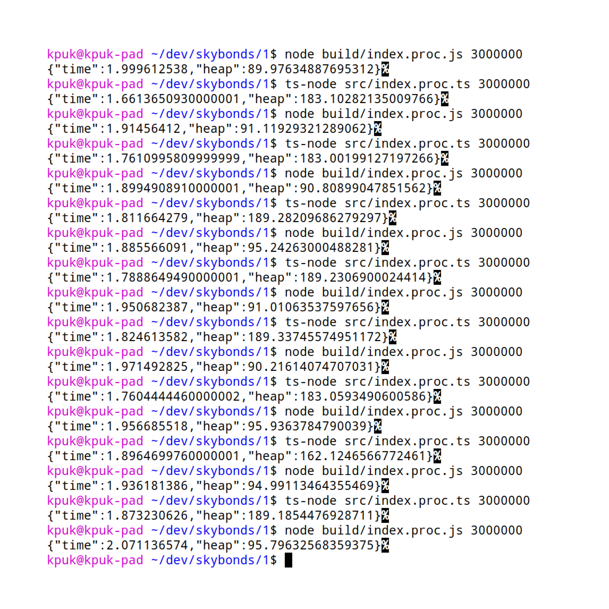
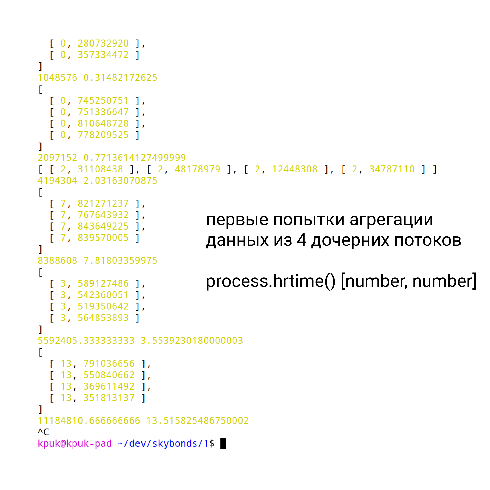
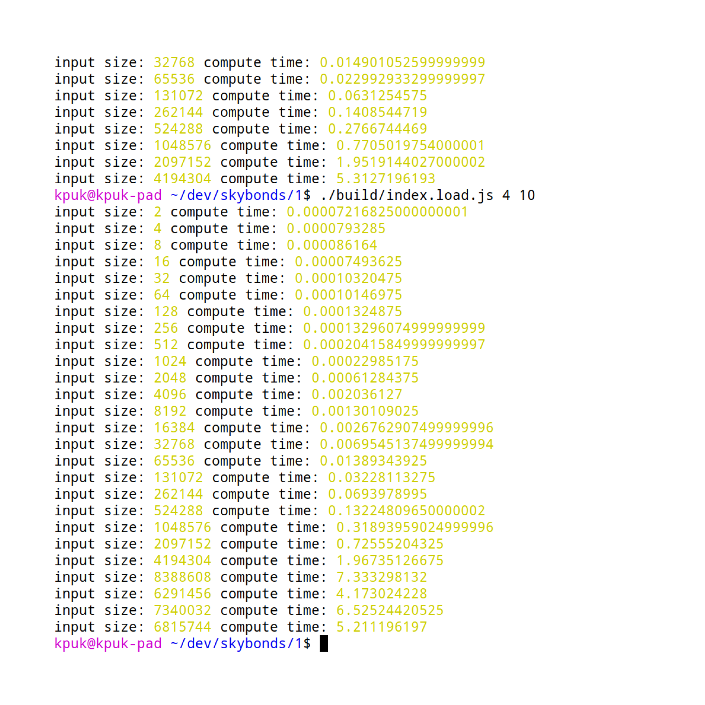
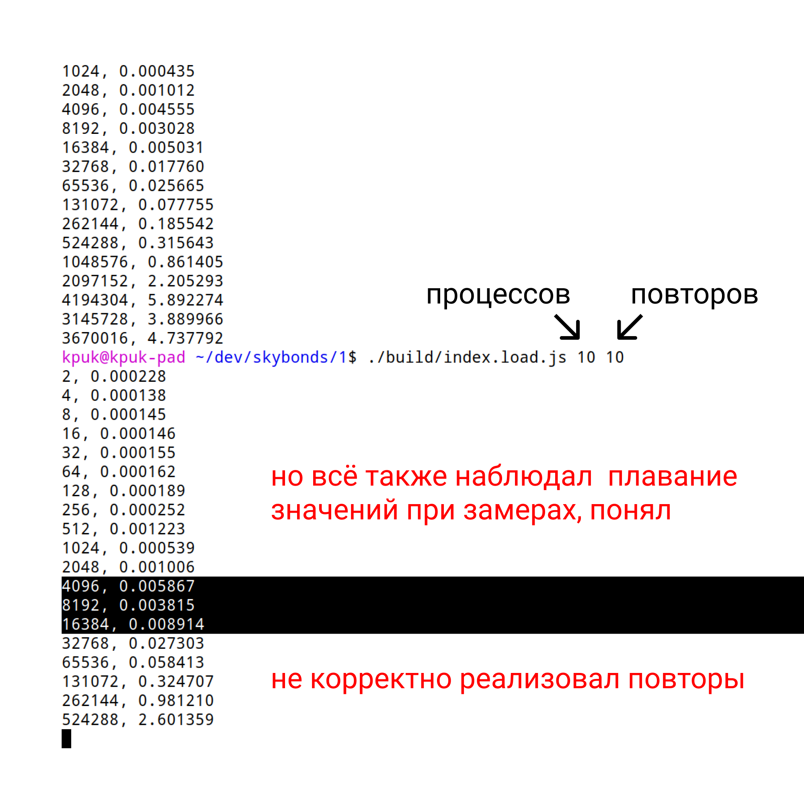
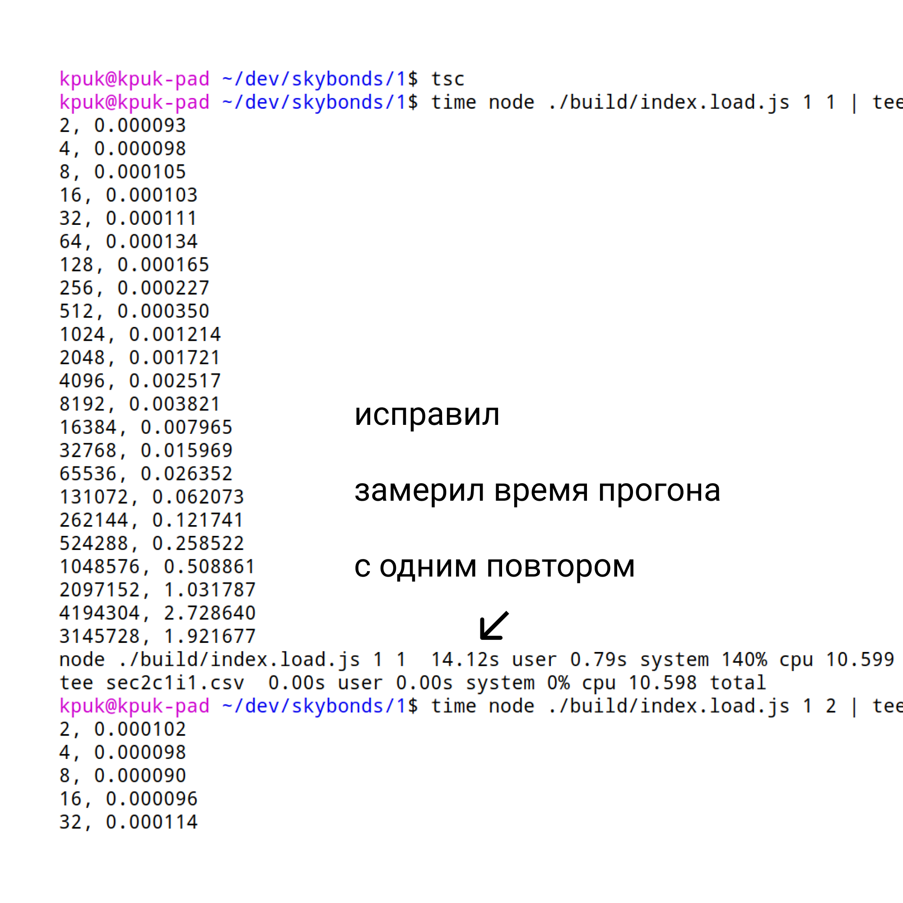
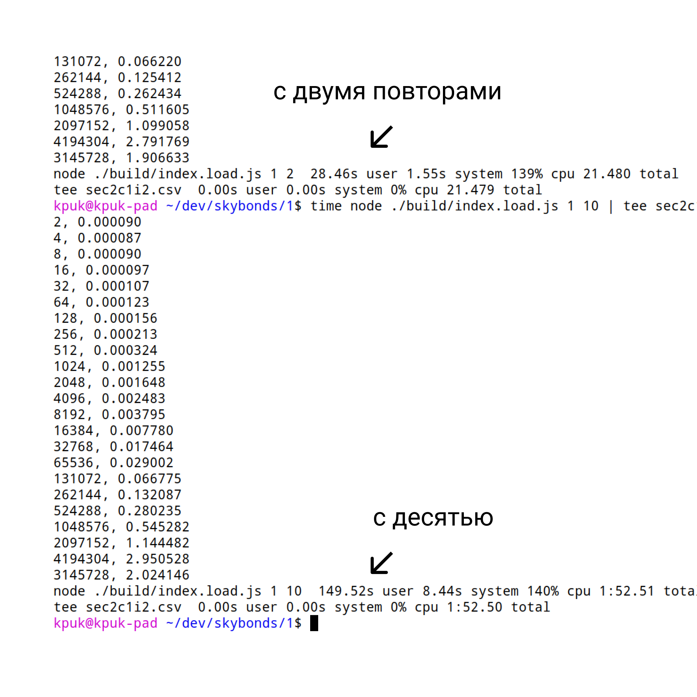
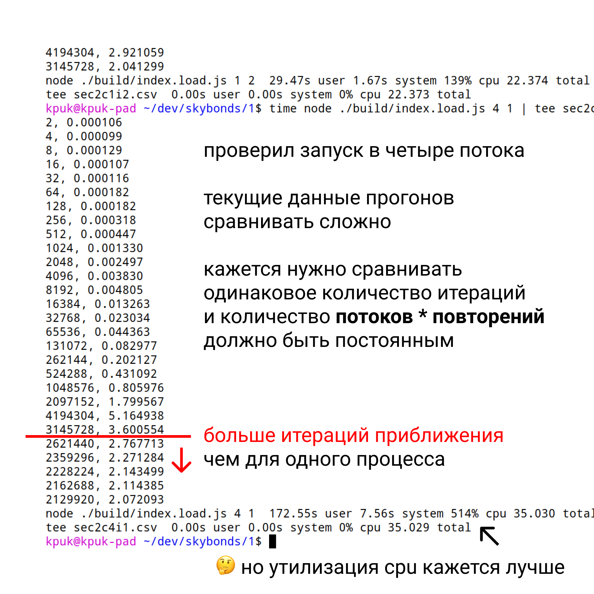
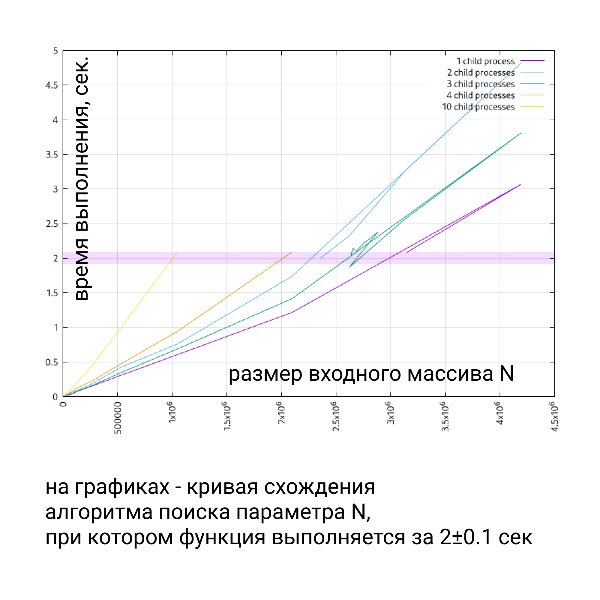
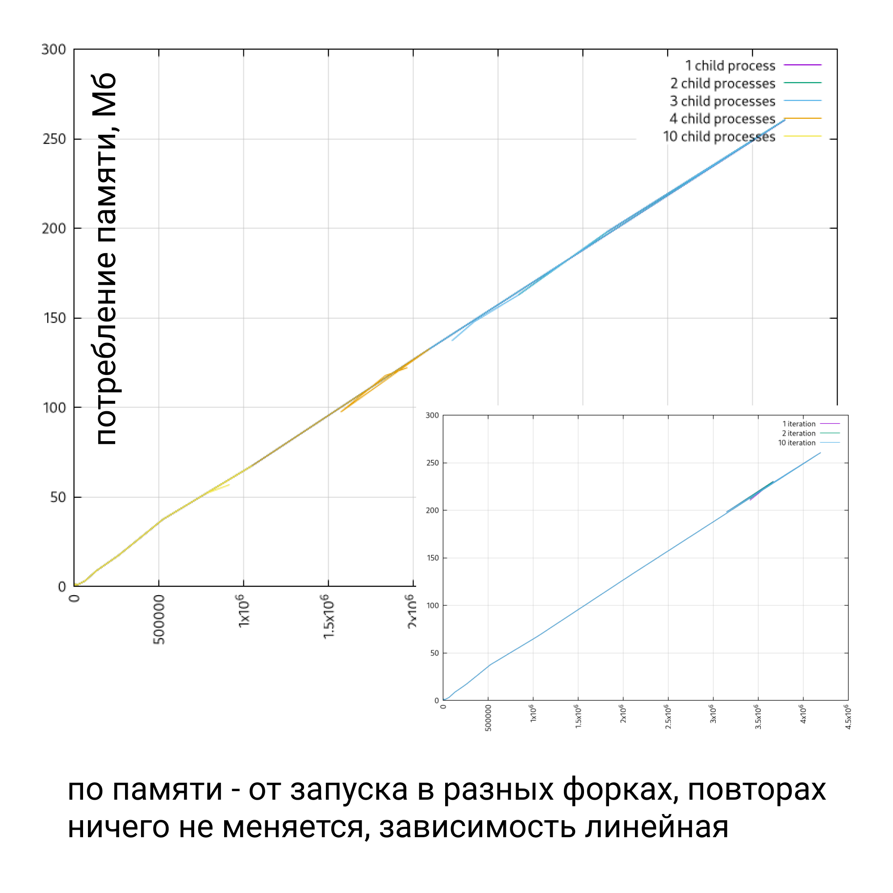
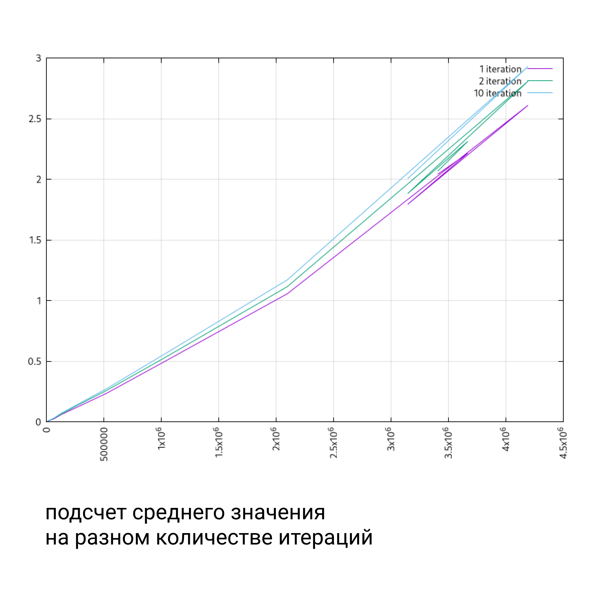

# ts-node vs node

Имея исходный код на typescript,
у меня есть как минимум два варианта его запуска:

- можно запускать заранее транслиттерованный код
- ну либо производить данную транслиттерацию runtime

Мне показалось, что время выполнения должно быть одинаковым,
решил пересчитать на финальной версии скрипта.

Мне не удалось дешевым способом пробросить `--expose-gc` в запуск ts-node.

Поэтому следующие результаты - без принудительного вызова garbage collector, перед запуском замеров.

- в случае с запуском через ts-node - gc кажется не успевает быть вызванным
- в случае же с node - он вызывается, от этого памяти на heap'e в итоге зарегистрированно меньше

TODO: можно покапать ts-node vs node, найти больше деталей, но я просто решил запускать и сравнивать заранее транслиттерованный код, идти дальше

# Бинарный поиск параметра N

Для нагрузочного тестирования решил запускать код функции в разных дочерних процессах, параллельно.

Далее реализовал рекурсивный вариант алгоритма поиска параметра, при котором, функция будет выполняться 5 секунд.

Нашел багу, из-за которой повторы обсчитывались параллельно, в дочерних процессах,

Переписал на итеративный вариант с функциональных `Promise.all(.map(_ => Promise))`

Описал рутины запусков измерений на разных входных параметрах sh скриптами, сбор результатов в csv.

И всё ради того, чтобы прикинуть, лучше ли утилизация CPU, 
можно ли попробовать маштабировать данный алгоритм техниками разделяй и властвуй, map-reduce всякие..

# Графики

Собранные результаты - итерации приближения к "приемлемому времени".

Последние шаги алгоритма - могут быть к меньшим значениям параметра N.

Поэтому gnuplot строит не совсем "график функции", 
просто проводит линию дальше к паре координат из данных:

от этого "хвосты возвращаются"

## Вывод

Утилизация CPU при параллельных вычислениях кажется лучше.

За 2 сек 4-ядерный (8 витруальных потоков) обсчитал (грубо):

- 10 потоков x 1*10^6 элементов = 1*10^7 элементов
- 1 поток x 3*10^6 элементов = 3*10^6 элементов

Кажется можно пробовать производить частичный подсчет сумм параллельно,
с последующим подсчетом результатов.

Но для начала провести простейшие оптимизации - избавится от лишних проходов по массиву например.

# Не такие важные графики

зависимость памяти от параметра N - ожидаемо линейная зависимость

при повторах - точность видно что время от количества элементов - варьирурется не сильно

(поэтому я производил измерения без повторений в итоге)
