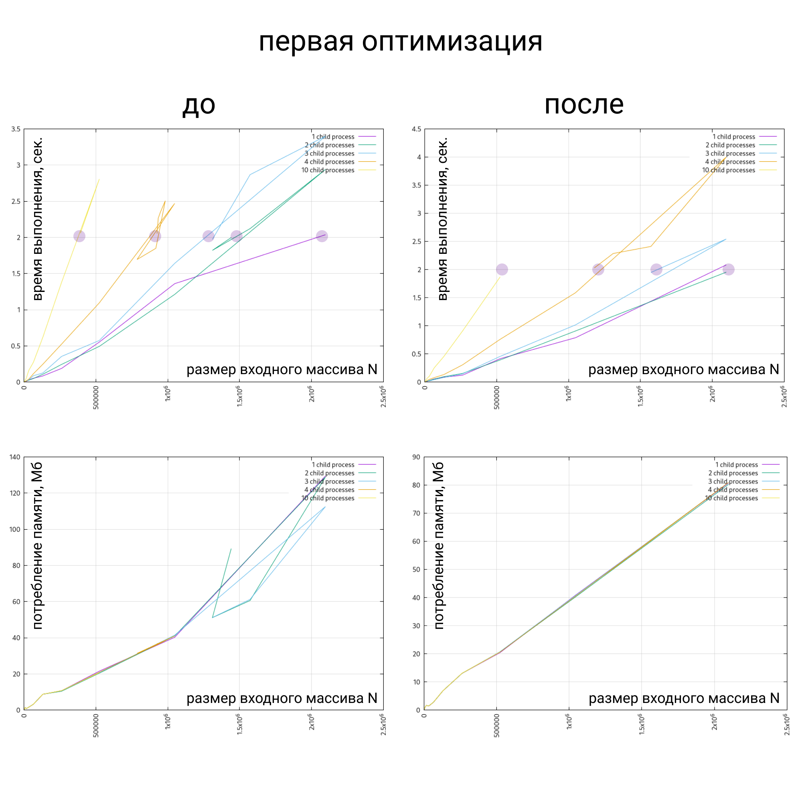

# Очевидная оптимизации

Решая задачу, специально сделал не оптимальное число проходов входного массива.

Исправил, закоммитил.

При снятии замеров производительности, процессы запущенные в системе влияют драматично.

А это значит при локальных прогонах никакой работы в figma, максимум текстовый редактор.

А мне тут недавно перепали ресурсы Yandex.Cloud.

Создал VM на Ubuntu 16.04, 2 ядра 1Гб оперативы.

Установил git, nvm, запустил прогоны, стянул результаты, зачекаутился, запустил прогоны, стянул результаты.

Странные скочки по потреблению памяти.

Кажется gc включался в процессе, значит замеры придётся переснять.

Создал VM на Ubuntu 18.04, с 2Гб оперативы повторил действия.

Чтд
