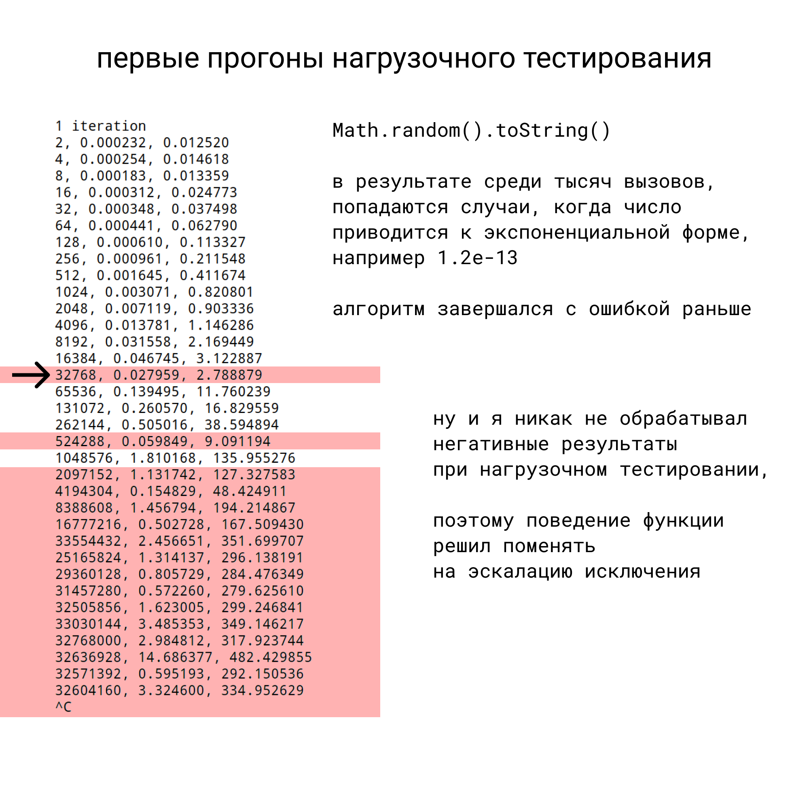
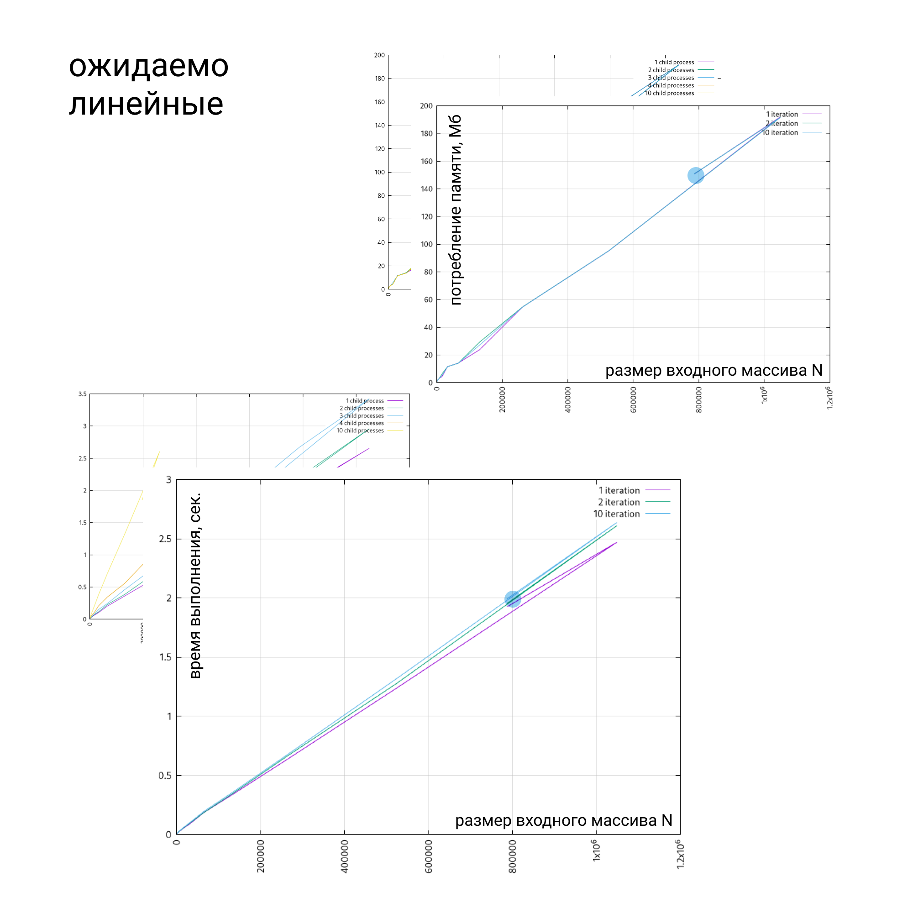
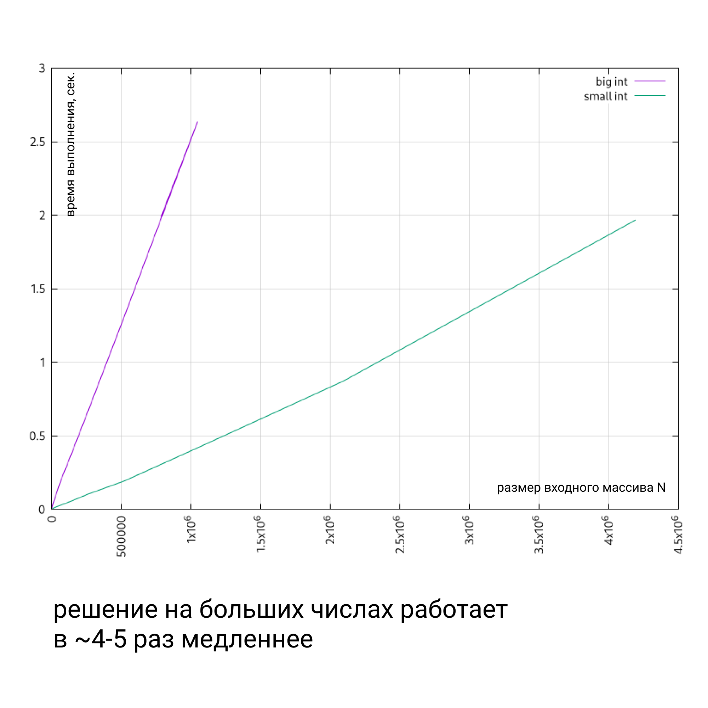
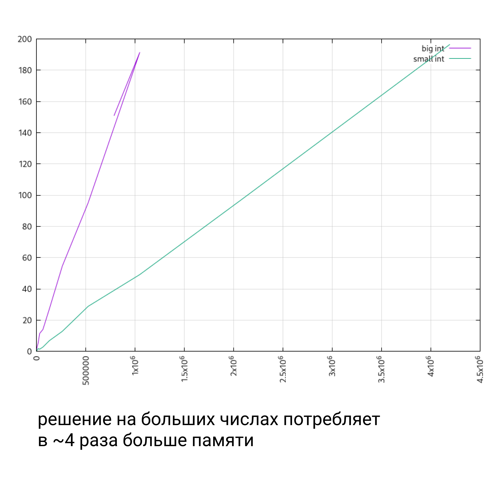

# Более общее решение

К сожалению в этот период был в разъездах, поэтому не мог запланировать, когда смогу уделять этому время. Поэтому нет четких оценок по времени - трудозатрам. Только постфактум, да и то в самолетах и поездах, что тоже не очень информативно.

## Работа с большими числами

После первого приближения стало понятно, что решение не будет работать на больших числах, а также если их сумма будет больше допустимых для хранения.

Поэтому пришлось доработать первое решение.

### BigInt

Логику было решено построить на вычисление арифметики на нативных больших числах, потому что по всем показателям они показывают большую производительность, характеристики, по сравнению с библиотеками [на май 2018-ого](https://habr.com/ru/post/354930/).

Браузеры позволяют в итоге работать с целочисленными значениями, выходящими за рамки обычных чисел. 
Но не предоставляют логики для работы с дробными числами. 
То есть, мы можем складывать, вычитать, умножать и делить, но только для целочисленных. 
Результаты подобных операций - тоже целочисленные.

### Немного арифметики

Для подсчитывания долей, нам достаточно складывать дробные числа, вычитать (делить). 

Любые входные данные, можно привести к хранению целочисленной части и дробной раздельно, для удобства преобразовывать в большие числа. 

Это позволит реализовать недостающую логику для решения задачи про доли. 

Нам нужно лишь реализовать сложение больших дробных чисел, а узнать соотношение числа к сумме, мы вычислим приводя их к целочисленным путём умножения числителя и знаменателя на 10, пока они не станут целыми.

### Ход решения

Все места подсчетов изменил на использование больших чисел, благо `number` и `bigint` в тайпскрипте хорошо типизируются. 

Понял что нужно писать свои парсеры, выносить в отдельную структуру, назвал её `BigFloat`, там же решил инкапсулировать логику по работе с ними. 

Описал тесты для граничных состояний. 

Всё вышло достаточно прямолинейно.

Из интересного:

`Math.random()`, который я использовал для генерации данных нагрузочного тестирования, может возвращать достаточно малые числа, при которых `toString` на этих числах, выводит число в экспоненциальной форме. Так как в первом решении я использовал `parseFloat`, который нормально это парсит, этого я не заметил. А вот при парсинге собственноручном, это всплыло в скачках метрик.



Что натолкнуло на мысль, что просто возвращать ошибку, без экскалации, не самая моя лучшая идея.. Поэтому в финальном варианте ещё и поменял интерфейс функции подсчета доль. Теперь он всегда возвращает значения, а в случае ошибки - выбрасывает исключение.

## Метрики

Самое интересное.. насколько решение просело по производительности :)

Графики основных метрик - ожидаемо линейные.



К сожалению данных прогонов не сохранилось, поэтому

```
git checkout 9ea159f89b35ca64e4609dabd904b9cfa0faf564
npm run build
./.benchmark.sh
```

Ну и с небольшим изменением скрипта графика, располагаем рядом, для сравнения результатов.




## Выводы

Без особых оптимизаций, переход на большую арифметику показал производительность в 4 раза медленней, прожорливей. Но зато решение работает и на более широких входных требованиях. Которые к слову, никак не упоминаются в условиях задачи. 

Заложенные технологические блага, в частности typescript, позволили производить рефакторинг и исправления кода значительно проще.

Тесты и обмазывание метриками позволили собирать и анализировать данные на этапах оптимизаций.

Что могло пройти лучше - я мог найти контакты заказчика и уточнить системные требования до выполнения задания, а не делать допущения о требованиях.
